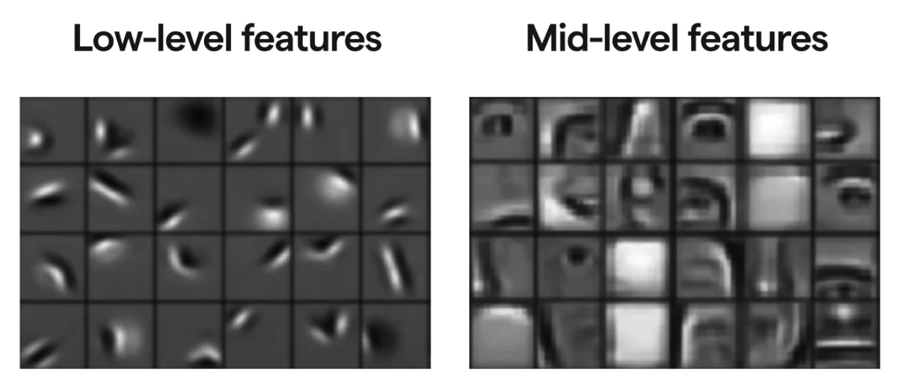
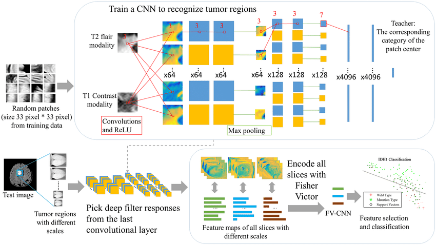

# Intro to the idea behind CNNs

Ocean physical and biological properties, like chlorophyll or SST or salinity, are random. They have strong spatial patterns. Remote-sensing data of these properties is often gridded. **Convolutional Neural Networks (CNNs)** is a type of machine learning model that is especially good at working with image-like, gridded data such as gridded remote-sensing data. 

Imagine you’re looking at a satellite photo of the ocean. If you cover all but one pixel, it’s hard to guess what’s going on. But if you can see the area around that pixel — the texture, gradients, and larger features — you get a much clearer picture. That’s what a CNN does: it uses **spatial context** to make better predictions.

## What Makes CNNs Useful for Remote Sensing?

CNNs are designed to take in **spatially structured data** — such as maps of SST, chlorophyll or salinity — learn the patterns in those maps and then use those patterns to help make predictions. For example, in our first toy example, we will use SST and salinity to predict chlorophyll.

A key feature of CNNs is that they don’t just look at one pixel at a time. Instead, they look at a **spatial patch** — meaning the CNN uses **the neighborhood around a location (x, y)** to predict the CHL at (x, y).

This allows the CNN to:
- Learn patterns like fronts, gradients, or eddies
- Use context from surrounding areas to make better predictions

A key aspect of CNNs is "feature identification".

## What is feature extraction?

**Feature extraction** means identifying and using the most useful parts of the input data to make a prediction.  In the context of CNNs, this happens automatically: the model learns which spatial patterns in the predictor variables (in our toy example, these are SST and salinity) predict the response variable (in our example, chlorophyll), without us needing to specify them.

For example:
- A strong SST gradient might indicate an upwelling zone
- A warm patch surrounded by cooler water might signal bloom potential
- The combination of temperature and salinity patterns may hint at water mass mixing

The CNN learns these kinds of associations through training, and uses them to predict missing CHL values.

## Let's see an example

## CNN layers

When we use a CNN, it analyzes the image in n x n blocks and layers of increasing block sizes. For our simple (toy) CNN, we are using 3 layers, 2 fitting layers and then a prediction layer.

---

### Layer 1 — Fine-Scale Patterns

- Uses a 3×3 patch of data
- Compares the center pixel to its 8 neighbors
- Learns to detect **local contrasts**, like:
  - A pixel that’s warmer than its surroundings
  - A sharp salinity gradient
- These are simple patterns, like edges or small shifts

---

### Layer 2 — Bigger Patterns

- Builds on the outputs from Layer 1
- Sees a 5×5 neighborhood in the original input
- Starts to recognize **larger structures**, like:
  - Small warm patches
  - Curved fronts
  - Local eddies
- Think of it as combining fine patterns into meaningful shapes

---

### Layer 3 — Useful Information for Prediction

- Sees a 7×7 neighborhood in the input
- Combines earlier features to make a **prediction for CHL** at each pixel. We will use a linear combination of the features.

Conceptually we have something like this with $k$ features in our trained model.

$$
\text{prediction}(i, j) = w_1 \cdot F_1(i, j) + w_2 \cdot F_2(i, j) + \dots + w_{k} \cdot F_{k}(i, j) + b
$$

---

### Key Idea

> Each CNN layer **adds spatial context**, going from tiny local differences to broader patterns that are useful for predicting CHL.

So the model isn’t just looking at SST and salinity at a single location — it’s using a **7×7 spatial area** around each pixel to make smarter, spatially informed predictions.

## Summary

The nature of the ocean means that there are certain patterns in our environmental variables that appear predictably: eddies, swirls, fronts, blobs, etc.

CNNs:
- work directly with spatial maps (like satellite imagery)
- use **neighboring information**, not just single-pixel values
- automatically learn useful spatial features to improve predictions
- a bit black boxy though we can get out the features (shapes) and that are important.
